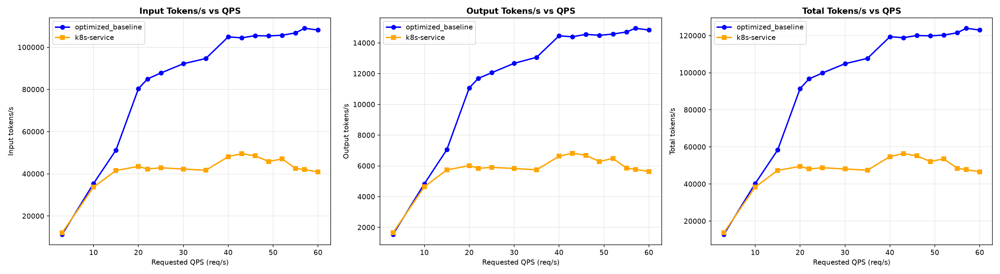
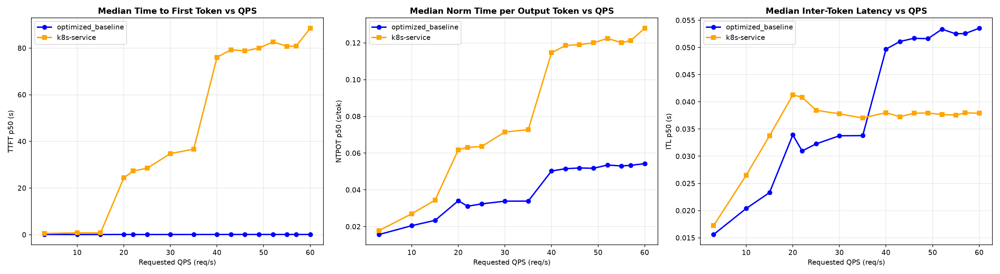
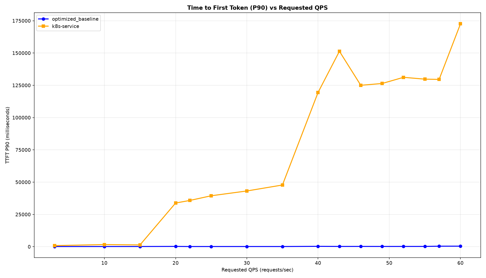

# Benchmark Report

The benchmark runs on 16 × H100 GPUs, distributed across 8 SGLang model servers (2 H100s per server with TP=2), serving
Qwen/Qwen3-32B. Workload is the guide's default `guide_optimized-baseline_1.yaml` shared-prefix profile
(6,000-token shared system prompt + 1,200-token question, 1,000-token output, rate ladder 3 → 60).

> [!NOTE]
> These results use the `prefix-cache-affinity-filter` with `peakPrefillThroughput: 30720` — the SGLang value from the
> [calibration matrix](../../../recipes/router/calibration/configuration-matrix.md) (`gpu/sglang` row), **not** the plugin
> default (`15928`, tuned for the vLLM reference). The router values file ships the generic default; set this on the filter
> to reproduce these numbers for the SGLang overlay. Both arms below ran the same workload against the same 8×TP=2
> SGLang configuration — the only difference is whether requests go through the llm-d router or a stock Service.

## Comparing llm-d Routing to a Simple Kubernetes Service (SGLang)

Graphs below compare optimized-baseline routing to a stock Kubernetes Service that round-robins requests across the same 8 SGLang pods (no EPP, no scoring).

Summary across the full ladder (rates 3 → 60):

| Metric            | k8s service (RR) | llm-d Optimized | Δ% vs k8s |
| :---------------- | :--------------- | :-------------- | :-------- |
| Output tokens/sec | 5,113            | 9,241           | +80.7%    |
| Requests/sec      | 5.16             | 9.33            | +80.8%    |
| TTFT p50 (s)      | 43.480           | 0.111           | −99.7%    |
| TTFT p90 (s)      | 127.168          | 0.250           | −99.8%    |
| ITL p50 (ms)      | 37.99            | 48.30           | +27.1%    |
| Failed requests   | 199              | 0               | —         |

The two arms diverge sharply once the fleet saturates. A stock Service spreads requests blindly, so every pod re-prefills the
6,000-token shared prefix: throughput flattens at ~6k output tokens/sec from rate 20 onward and first-token latency collapses
(TTFT p90 crosses 30&nbsp;s at rate 20 and reaches 172&nbsp;s at rate 60), with 199 requests failing to complete at all.
Prefix-cache-affinity routing keeps each prefix group resident on the same endpoints, so prefill stays cheap: throughput keeps
climbing to ~15k output tokens/sec and TTFT p90 stays **under half a second across the entire ladder**, with zero failures.

The ITL regression (+27.1%) is the expected trade: affinity routing packs more concurrent work onto cache-warm pods, so
per-token decode is marginally slower — a good exchange for 1.8× the throughput and a ~500× better first-token tail.

<b><i>Click</i></b> to view the per-rate breakdown across the full ladder

Output tokens/sec — higher is better; TTFT in seconds — lower is better.

| Rate | k8s Output | llm-d Output | k8s TTFT p90 | llm-d TTFT p90 |
| ---: | ---------: | -----------: | -----------: | -------------: |
|  3   | 1,647      | 1,536        | 0.867        | 0.148          |
| 10   | 4,644      | 4,838        | 1.656        | 0.161          |
| 15   | 5,740      | 7,056        | 1.396        | 0.173          |
| 20   | 6,018      | 11,077       | 33.849       | 0.244          |
| 22   | 5,843      | 11,693       | 35.845       | 0.152          |
| 25   | 5,906      | 12,063       | 39.469       | 0.157          |
| 30   | 5,831      | 12,675       | 43.176       | 0.161          |
| 35   | 5,746      | 13,066       | 47.802       | 0.156          |
| 40   | 6,629      | 14,463       | 119.486      | 0.303          |
| 43   | 6,828      | 14,399       | 151.379      | 0.222          |
| 46   | 6,686      | 14,561       | 125.039      | 0.236          |
| 49   | 6,285      | 14,493       | 126.431      | 0.212          |
| 52   | 6,488      | 14,578       | 131.208      | 0.217          |
| 55   | 5,855      | 14,711       | 129.790      | 0.231          |
| 57   | 5,769      | 14,954       | 129.604      | 0.413          |
| 60   | 5,642      | 14,839       | 172.690      | 0.437          |

