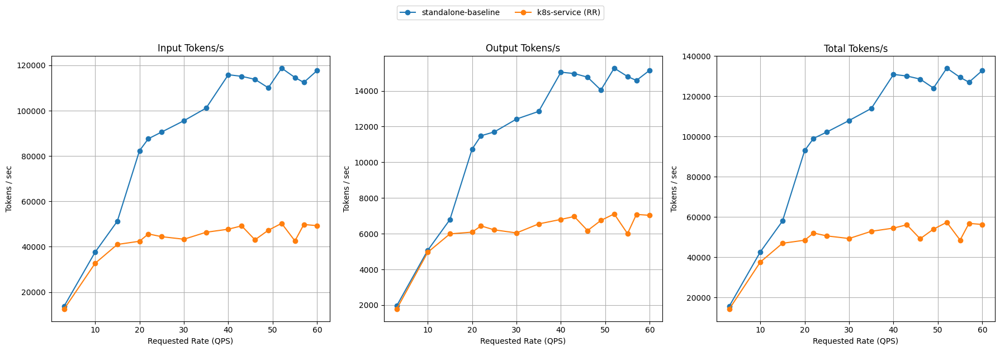
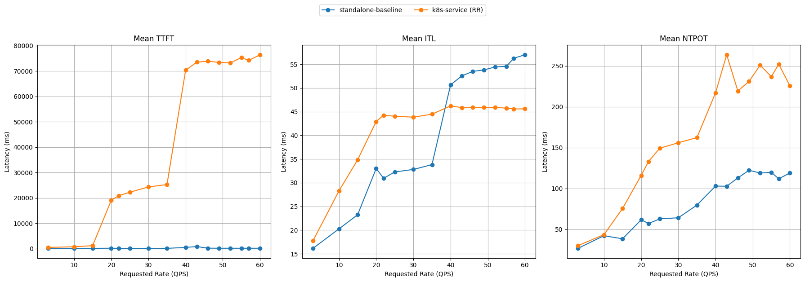
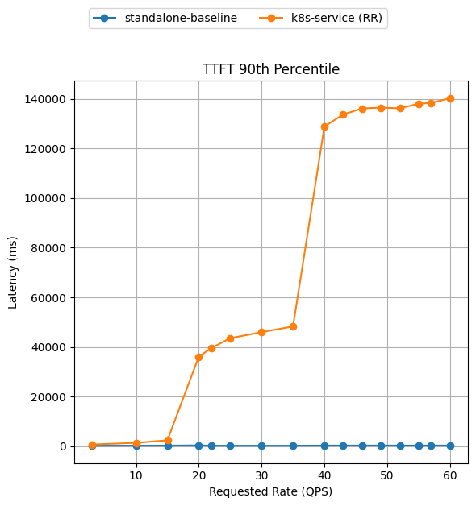

# Benchmark Report

The benchmark runs with decoders model Qwen/Qwen3-32B on 16 × H100 GPUs, distributed across 8 vLLM model servers (2 H100s per server with TP=2). Workload is the guide's `guide_optimized-baseline_1.yaml` shared-prefix profile (6,000-token shared system prompt + 1,200-token question, 1,000-token output) driven as a Poisson rate ladder (rates 3 → 60).

> [!NOTE]
> These results use the `prefix-cache-affinity-filter` + `token-load-scorer` routing. Latency is reported as median (p50);
> NTPOT (normalized time per output token) is end-to-end latency divided by output tokens. A few low-load and isolated
> stages report an empty latency histogram (shown as 0.0) and are dropped from the latency lines. Both arms ran the same
> workload against the same 8×TP=2 vLLM configuration — the only difference is whether requests go through the llm-d router
> or a stock Service.

## Comparing llm-d Routing to a Simple Kubernetes Service (vLLM)

Graphs below compare optimized-baseline routing to a stock Kubernetes Service that round-robins requests across the same 8 vLLM pods (no EPP, no scoring).

Summary (throughput is peak sustained; latencies at the top of the ladder, rate 60):

| Metric                    | k8s service (RR) | llm-d Optimized | Δ% vs k8s |
| :------------------------ | :--------------- | :-------------- | :-------- |
| Peak output tokens/s      | 7,049            | 14,941          | +111.9%   |
| Requests/sec (@ rate 60)  | 56.14            | 57.03           | +1.6%     |
| TTFT p50 (s)              | 88.1             | 0.2             | −99.8%    |
| TTFT p90 (s)              | 154.1            | 0.9             | −99.4%    |
| ITL p50 (ms)              | 37.8             | 37.5            | −0.8%     |

The two arms track each other until the fleet saturates. A stock Service round-robins blindly, so every pod re-prefills the
6,000-token shared prefix: output throughput plateaus at ~6–7k tokens/sec from ~rate 15 and first-token latency climbs into the
tens of seconds by rate 22. Prefix-cache-affinity routing keeps each prefix group resident on the same endpoints, so throughput
keeps climbing to ~15k tokens/sec (~2.1× the Service, peaking at 14,941 near rate 49) while TTFT p90 stays under ~1&nbsp;s across the ladder.

<b><i>Click</i></b> to view the per-rate breakdown across the full ladder

Output tokens/sec — higher is better; TTFT in seconds — lower is better. `0.0` = empty latency histogram for that stage.

| Rate | k8s Output | llm-d Output | k8s TTFT p50 | llm-d TTFT p50 | k8s TTFT p90 | llm-d TTFT p90 |
| ---: | ---------: | -----------: | -----------: | -------------: | -----------: | -------------: |
|  3   | 1,889      | 1,511        | 0.0          | 0.0            | 0.0          | 0.0            |
| 10   | 4,944      | 4,597        | 0.0          | 0.0            | 0.0          | 0.0            |
| 15   | 6,066      | 8,995        | 0.0          | 0.0            | 0.0          | 0.0            |
| 20   | 4,555      | 6,656        | 0.9          | 0.4            | 2.4          | 4.2            |
| 22   | 6,239      | 10,809       | 18.3         | 0.2            | 46.1         | 1.4            |
| 25   | 6,350      | 10,452       | 0.4          | 0.2            | 0.9          | 0.2            |
| 30   | 6,251      | 10,509       | 0.8          | 0.1            | 4.9          | 0.2            |
| 35   | 6,544      | 12,290       | 21.0         | 0.1            | 46.2         | 0.2            |
| 40   | 6,228      | 14,134       | 20.0         | 0.1            | 37.9         | 0.3            |
| 43   | 6,860      | 13,522       | 25.7         | 0.2            | 61.9         | 0.2            |
| 46   | 6,526      | 14,050       | 20.4         | 0.1            | 66.8         | 0.2            |
| 49   | 6,956      | 14,941       | 66.9         | 0.9            | 139.9        | 2.1            |
| 52   | 7,049      | 14,542       | 69.9         | 0.3            | 143.8        | 1.3            |
| 55   | 6,402      | 14,607       | 78.3         | 0.1            | 158.5        | 0.2            |
| 57   | 6,317      | 13,451       | 83.1         | 0.2            | 153.3        | 19.9           |
| 60   | 6,764      | 13,528       | 88.1         | 0.2            | 154.1        | 0.9            |

